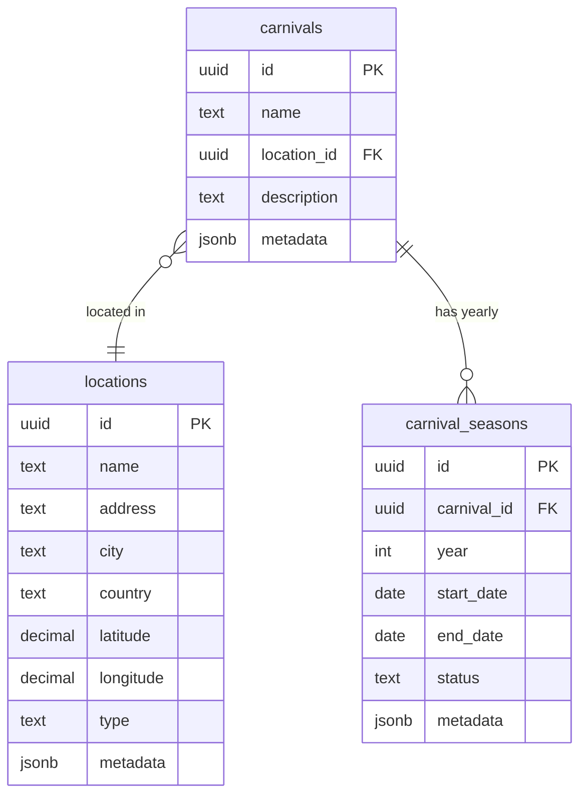
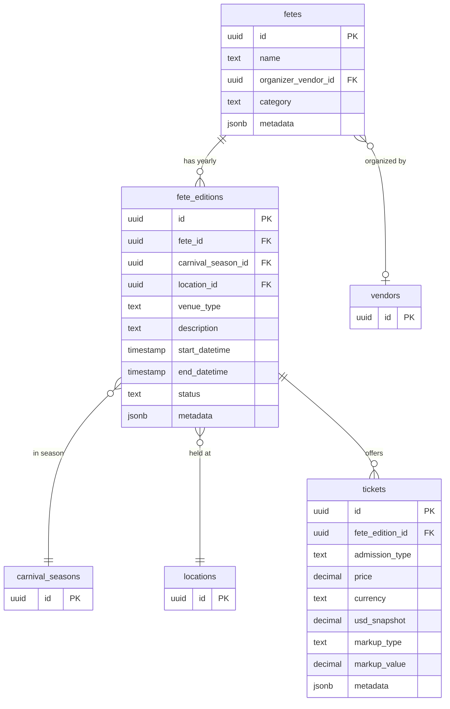
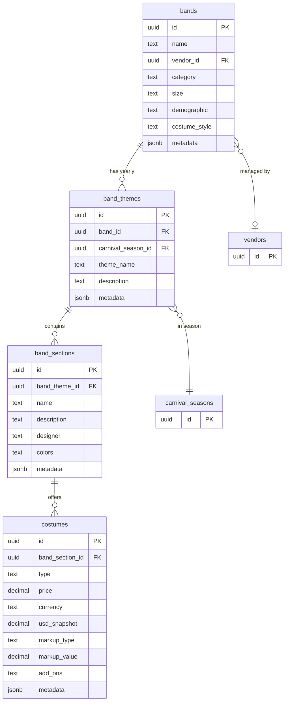
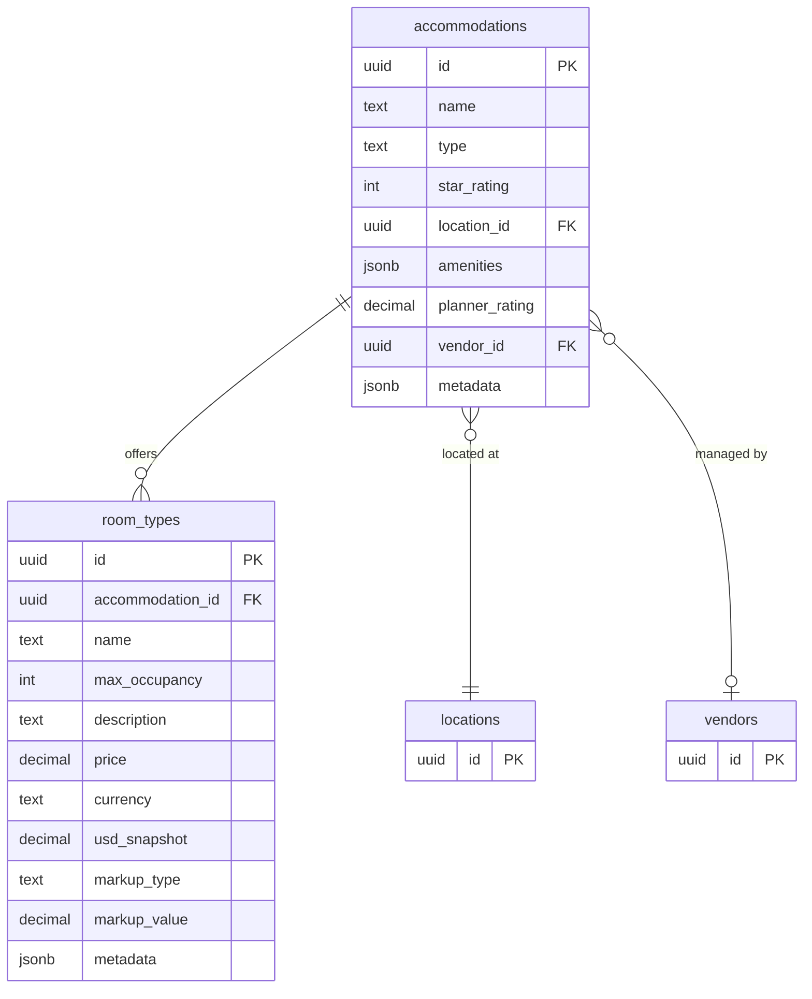
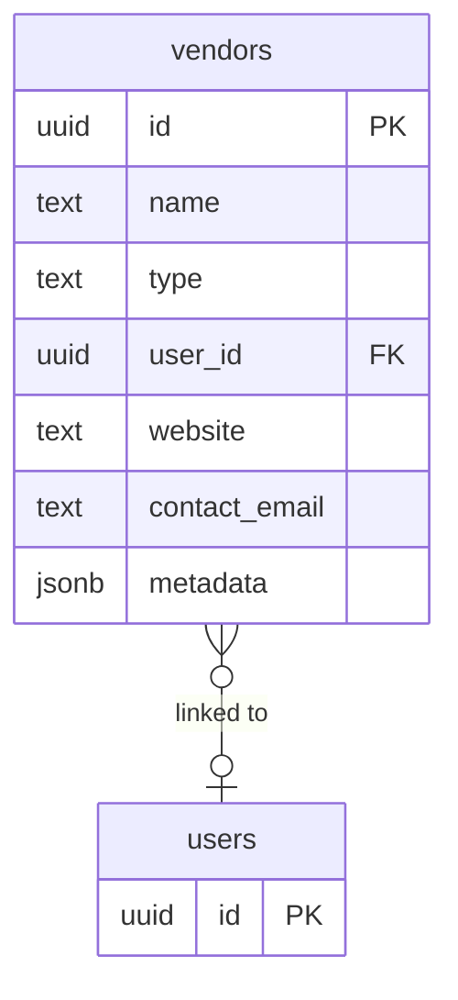
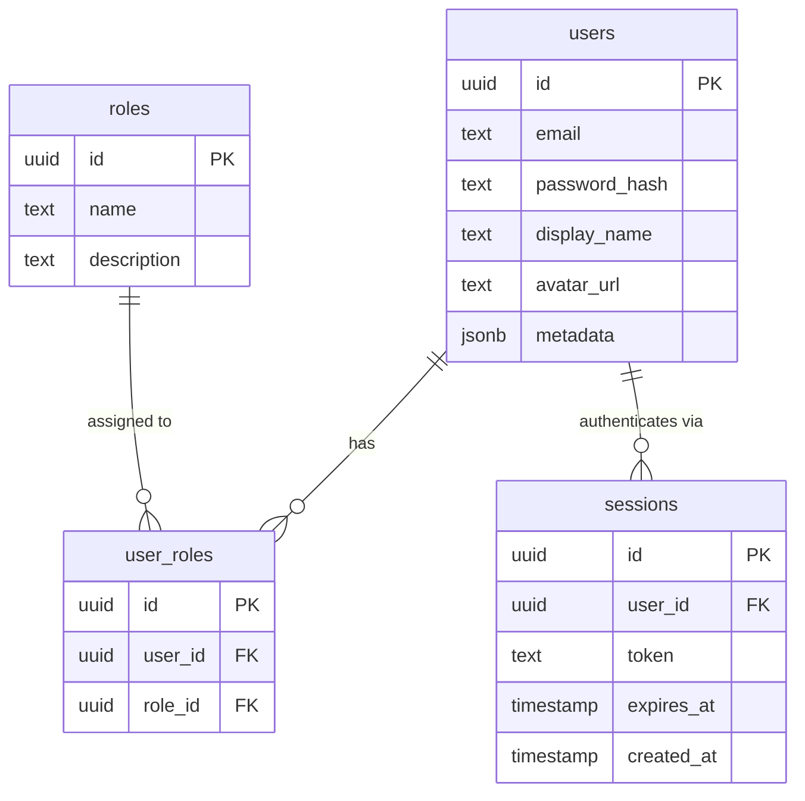
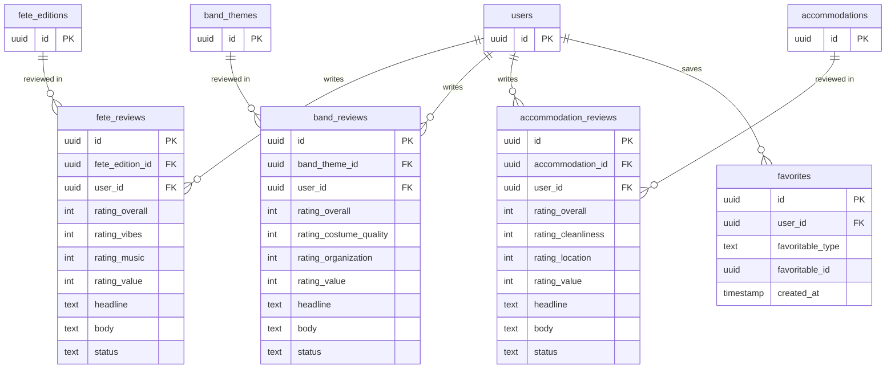
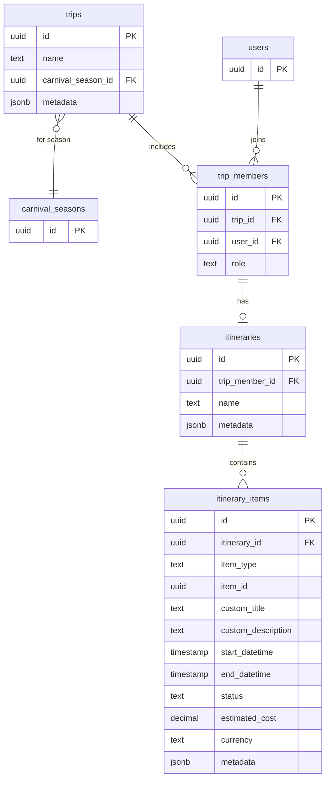
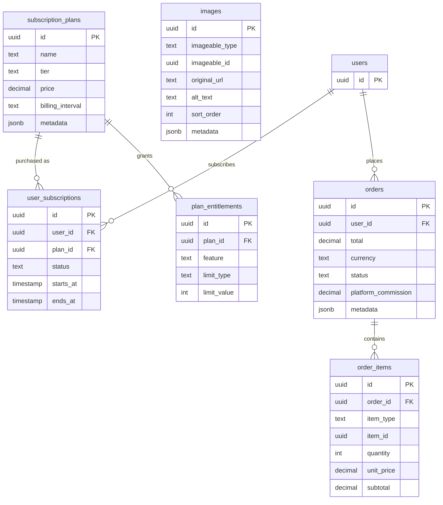

# Database Schema Diagram

**Last updated:** 2026-03-30

27 tables across 8 domain groups. Common columns (`created_at`, `updated_at`, `deleted_at`, `created_by`, `updated_by`) omitted for readability.

## Diagram

To view interactively: copy the code block below (raw view), paste into [mermaid.live](https://mermaid.live), then zoom/pan.

```mermaid
erDiagram
    carnivals {
        uuid id PK
        text name
        uuid location_id FK
        text description
        jsonb metadata
    }

    carnival_seasons {
        uuid id PK
        uuid carnival_id FK
        int year
        date start_date
        date end_date
        text status
        jsonb metadata
    }

    locations {
        uuid id PK
        text name
        text address
        text city
        text country
        decimal latitude
        decimal longitude
        text type
        jsonb metadata
    }

    fetes {
        uuid id PK
        text name
        uuid organizer_vendor_id FK
        text category
        jsonb metadata
    }

    fete_editions {
        uuid id PK
        uuid fete_id FK
        uuid carnival_season_id FK
        uuid location_id FK
        text venue_type
        text description
        timestamp start_datetime
        timestamp end_datetime
        text status
        jsonb metadata
    }

    tickets {
        uuid id PK
        uuid fete_edition_id FK
        text admission_type
        decimal price
        text currency
        decimal usd_snapshot
        text markup_type
        decimal markup_value
        jsonb metadata
    }

    bands {
        uuid id PK
        text name
        uuid vendor_id FK
        text category
        text size
        text demographic
        text costume_style
        jsonb metadata
    }

    band_themes {
        uuid id PK
        uuid band_id FK
        uuid carnival_season_id FK
        text theme_name
        text description
        jsonb metadata
    }

    band_sections {
        uuid id PK
        uuid band_theme_id FK
        text name
        text description
        text designer
        text colors
        jsonb metadata
    }

    costumes {
        uuid id PK
        uuid band_section_id FK
        text type
        decimal price
        text currency
        decimal usd_snapshot
        text markup_type
        decimal markup_value
        text add_ons
        jsonb metadata
    }

    accommodations {
        uuid id PK
        text name
        text type
        int star_rating
        uuid location_id FK
        jsonb amenities
        decimal planner_rating
        uuid vendor_id FK
        jsonb metadata
    }

    room_types {
        uuid id PK
        uuid accommodation_id FK
        text name
        int max_occupancy
        text description
        decimal price
        text currency
        decimal usd_snapshot
        text markup_type
        decimal markup_value
        jsonb metadata
    }

    vendors {
        uuid id PK
        text name
        text type
        uuid user_id FK
        text website
        text contact_email
        jsonb metadata
    }

    users {
        uuid id PK
        text email
        text password_hash
        text display_name
        text avatar_url
        jsonb metadata
    }

    roles {
        uuid id PK
        text name
        text description
    }

    user_roles {
        uuid id PK
        uuid user_id FK
        uuid role_id FK
    }

    sessions {
        uuid id PK
        uuid user_id FK
        text token
        timestamp expires_at
        timestamp created_at
    }

    fete_reviews {
        uuid id PK
        uuid fete_edition_id FK
        uuid user_id FK
        int rating_overall
        int rating_vibes
        int rating_music
        int rating_value
        text headline
        text body
        text status
    }

    band_reviews {
        uuid id PK
        uuid band_theme_id FK
        uuid user_id FK
        int rating_overall
        int rating_costume_quality
        int rating_organization
        int rating_value
        text headline
        text body
        text status
    }

    accommodation_reviews {
        uuid id PK
        uuid accommodation_id FK
        uuid user_id FK
        int rating_overall
        int rating_cleanliness
        int rating_location
        int rating_value
        text headline
        text body
        text status
    }

    favorites {
        uuid id PK
        uuid user_id FK
        text favoritable_type
        uuid favoritable_id
        timestamp created_at
    }

    trips {
        uuid id PK
        text name
        uuid carnival_season_id FK
        jsonb metadata
    }

    trip_members {
        uuid id PK
        uuid trip_id FK
        uuid user_id FK
        text role
    }

    itineraries {
        uuid id PK
        uuid trip_member_id FK
        text name
        jsonb metadata
    }

    itinerary_items {
        uuid id PK
        uuid itinerary_id FK
        text item_type
        uuid item_id
        text custom_title
        text custom_description
        timestamp start_datetime
        timestamp end_datetime
        text status
        decimal estimated_cost
        text currency
        jsonb metadata
    }

    subscription_plans {
        uuid id PK
        text name
        text tier
        decimal price
        text billing_interval
        jsonb metadata
    }

    user_subscriptions {
        uuid id PK
        uuid user_id FK
        uuid plan_id FK
        text status
        timestamp starts_at
        timestamp ends_at
    }

    plan_entitlements {
        uuid id PK
        uuid plan_id FK
        text feature
        text limit_type
        int limit_value
    }

    orders {
        uuid id PK
        uuid user_id FK
        decimal total
        text currency
        text status
        decimal platform_commission
        jsonb metadata
    }

    order_items {
        uuid id PK
        uuid order_id FK
        text item_type
        uuid item_id
        int quantity
        decimal unit_price
        decimal subtotal
    }

    images {
        uuid id PK
        text imageable_type
        uuid imageable_id
        text original_url
        text alt_text
        int sort_order
        jsonb metadata
    }

    carnivals }o--|| locations : "located in"
    carnivals ||--o{ carnival_seasons : "has yearly"

    fetes ||--o{ fete_editions : "has yearly"
    fete_editions }o--|| carnival_seasons : "in season"
    fete_editions }o--|| locations : "held at"
    fete_editions ||--o{ tickets : "offers"
    fetes }o--o| vendors : "organized by"

    bands ||--o{ band_themes : "has yearly"
    band_themes }o--|| carnival_seasons : "in season"
    band_themes ||--o{ band_sections : "contains"
    band_sections ||--o{ costumes : "offers"
    bands }o--o| vendors : "managed by"

    accommodations ||--o{ room_types : "offers"
    accommodations }o--|| locations : "located at"
    accommodations }o--o| vendors : "managed by"

    vendors }o--o| users : "linked to"

    users ||--o{ user_roles : "has"
    roles ||--o{ user_roles : "assigned to"
    users ||--o{ sessions : "authenticates via"

    fete_editions ||--o{ fete_reviews : "reviewed in"
    users ||--o{ fete_reviews : "writes"
    band_themes ||--o{ band_reviews : "reviewed in"
    users ||--o{ band_reviews : "writes"
    accommodations ||--o{ accommodation_reviews : "reviewed in"
    users ||--o{ accommodation_reviews : "writes"

    users ||--o{ favorites : "saves"

    trips }o--|| carnival_seasons : "for season"
    trips ||--o{ trip_members : "includes"
    users ||--o{ trip_members : "joins"
    trip_members ||--o| itineraries : "has"
    itineraries ||--o{ itinerary_items : "contains"

    users ||--o{ user_subscriptions : "subscribes"
    subscription_plans ||--o{ user_subscriptions : "purchased as"
    subscription_plans ||--o{ plan_entitlements : "grants"
    users ||--o{ orders : "places"
    orders ||--o{ order_items : "contains"
```

---

## By Domain Group

Smaller diagrams for reviewing in markdown preview. Each shows cross-group references as stubs (PK only).

### Core Domain

Carnivals reference a location (area type) and have yearly seasons. Locations are shared across carnivals, fetes, and accommodations.

### Fetes

Thin master (identity only: name, organizer, category). All variable details live on the edition.

### Bands

4-level hierarchy: band → yearly theme → sections → individual costumes.

### Accommodations

Accommodations with room types. Linked to locations and optionally managed by vendors.

### Vendors

Unified vendor table. One profile per vendor regardless of type, with JSONB metadata for type-specific attributes.

### Users & Auth

Single user table. RBAC via roles. Sessions stored in Postgres.

### Reviews & Favorites

Separate review tables per entity type with different rating dimensions. Single polymorphic favorites table.

### Trip Planning

Trips tied to a carnival season. Members each get an itinerary. Items can reference platform entities or be freeform custom entries.

### Commerce & Media

Subscriptions with entitlements for content gating. Orders stubbed for future marketplace. Polymorphic images table.

---

## Table Summary

| Group | Tables | Count |
|-------|--------|-------|
| **Core** | `carnivals`, `carnival_seasons`, `locations` | 3 |
| **Fetes** | `fetes`, `fete_editions`, `tickets` | 3 |
| **Bands** | `bands`, `band_themes`, `band_sections`, `costumes` | 4 |
| **Accommodations** | `accommodations`, `room_types` | 2 |
| **Vendors** | `vendors` | 1 |
| **Users & Auth** | `users`, `roles`, `user_roles`, `sessions` | 4 |
| **Reviews & Favorites** | `fete_reviews`, `band_reviews`, `accommodation_reviews`, `favorites` | 4 |
| **Trip Planning** | `trips`, `trip_members`, `itineraries`, `itinerary_items` | 4 |
| **Commerce & Media** | `subscription_plans`, `user_subscriptions`, `plan_entitlements`, `orders`, `order_items`, `images` | 6 |
| | | **27** |

## Conventions (all tables)

- `created_at`, `updated_at`, `deleted_at` (soft deletes) — omitted from diagram
- `created_by`, `updated_by` (FK to users) — omitted from diagram
- Pricing: original currency + currency code + USD snapshot + markup (type + value). Display price calculated at query time.
- JSONB `metadata` column as escape hatch for type-specific flexibility

## Enum Values

- **carnival_seasons.status:** planning, active, archived
- **locations.type:** venue, hotel, area
- **fetes.category:** Fete, Traditional Jouvert, Traditional Carnival Event, Jouvert Style
- **fete_editions.venue_type:** Resort, Field, Beach, Boat, Stadium, Poolside, Hotel, Waterfront Resort, Road, Restaurant, Street, Golf course, Waterfront, Events Venue
- **bands.category:** Large, Medium, Mini, Kids Medium Band, Presentation Band
- **bands.size:** Less than 500, 500-1500, 1500-2500, 2500-3500, 3500-5000, More than 5000
- **bands.demographic:** All ages, 18-35, 25-55, 35-55
- **bands.costume_style:** Skimpy with fewer cover-up options, Varies with many cover-up options, Full coverage options
- **vendors.type:** organizer, band, hotel, designer
- **costumes.type:** male, female, frontline, backline
- **markup_type:** none, percentage, flat, fixed (negative values = discount)
- **review status:** pending, approved, flagged, rejected
- **trip_members.role:** organizer, member
- **itinerary_items.item_type:** fete_edition, band_theme, accommodation, custom
- **itinerary_items.status:** interested, booked, paid, confirmed
- **subscription_plans.tier:** free, basic, premium
- **user_subscriptions.status:** active, cancelled, expired
